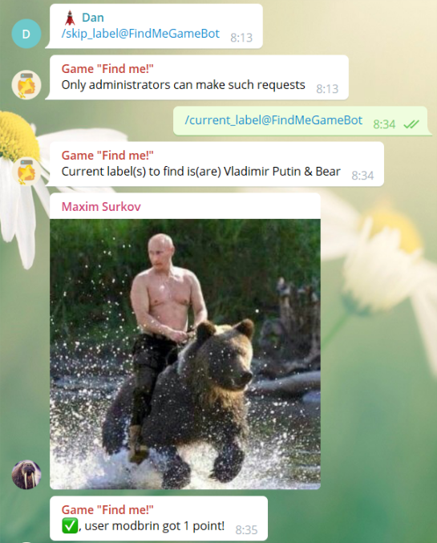
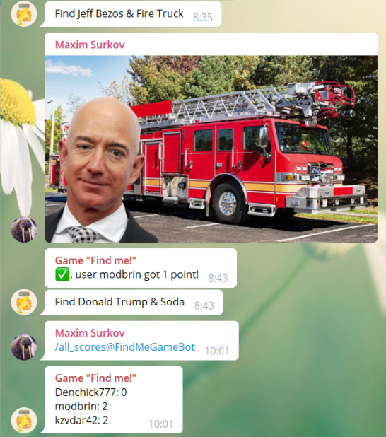
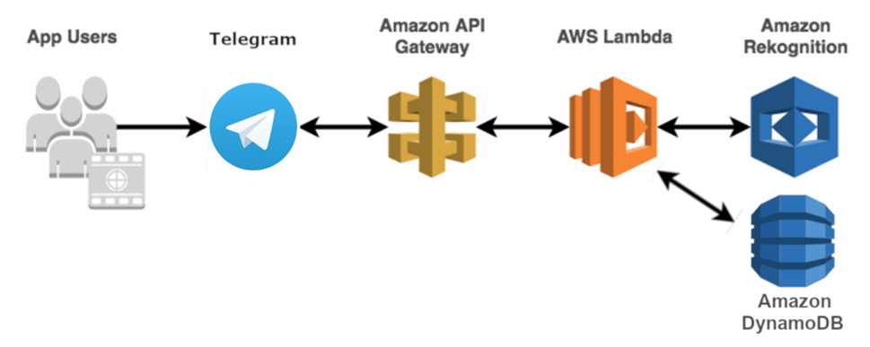

# "Find Me!" - game in a messenger.

Simple game for the Telegram messenger, using the AWS services for the image recognition, storage and logic for the bot.\
The project is based on the [Serverless-HotDog-Detector](https://github.com/aws-samples/serverless-hotdog-detector).

**Authors:**
Maxim Surkov\
Boris Guryev\
Denis Chernikov\
Vladislav Kuleykin

## Purpose
This project was created during the *Distributed Systems and Cloud Computing* course at *Fall 2018* at *Innopolis University*.

## How to deploy

Firstly, you'll need to reate a Telegram bot. ([how to do that](https://core.telegram.org/bots#6-botfather))
After that, put the alias and token, that you've got after creation of the bot into the cloudformation template.
Then execute the next two commands in the `AWS CLI`:

```bash
> aws cloudformation package --template-file template.yaml --s3-bucket <name-of-your-bucket> --output-template-file packaged.yaml

Successfully packaged artifacts and wrote output template to file packaged.yaml.

> aws cloudformation deploy --template-file packaged.yaml --stack-name <name-of-your-stack> --capabilities CAPABILITY_IAM

Waiting for changeset to be created..
Waiting for stack create/update to complete
Successfully created/updated stack - <name-of-your-stack>
```

After that, if you've got the appropriate responses, go to the created stack and get the link to the method `post_message` of the created API Gateway ([how to do that](https://docs.aws.amazon.com/apigateway/latest/developerguide/how-to-call-api.html#how-to-call-api-console)) and add this link as a Webhook to your bot. ([how to do that](https://core.telegram.org/bots/api#setwebhook))

After this everything should be working.

## How to Delete

Go to the created stack, click `Other Actions` and `Delete Stack`, this should delete all created resources.\
If this is not working, you can delete all them manually.\
Created resources:
* Lambda function *GameFindMeLogic* as the main logic of the game;
* DynamoDB tables *gameFindMeUsers* and *gameFindMeGameStates* for storing game states;
* API Gateway (should have the same name as the stack) for invocation of lambda function through Telegram.

### Game Rules
The Game is played by a group of people in a messenger group chat.

At the start of the game, admins of the chat can modify the settings of the game (difficulty, category, etc.). When the game starts each player has score and he receives points when sends a photo of required object to chat, and game randomly selects new objects to find.

There are several game types:
1) Find single object;
2) Find several objects in one photo;
3) Find celebrity;
4) Find celebrity with an random object.

### Screenshots
<p align="center">
  
  
</p>


### Implementation Details
Game Logic is deployed as an AWS Lambda function. Competition state is stored through integration with AWS DynamoDB and attached to the Lambda. The Game Logic is independent from user interface handler and thus would be accessible either through Telegram bot or through other third-party extension (such as a Slack Application).

### HLD

